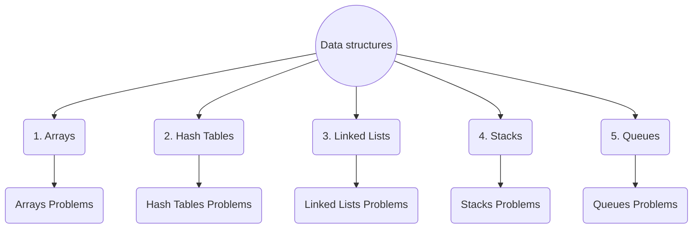

# Introduction

Computer science is all about problem solving.

Understanding Data Structures & Algorithms is vital for writing efficient computer programs.

## Algorithm

Algorithm is a set of steps a program takes to complete a task.

## Data Structures

Data structures are used for storing and organizing data in computer memory so that it can be used efficiently. Data structures can be **linear** and **non-linear**.

